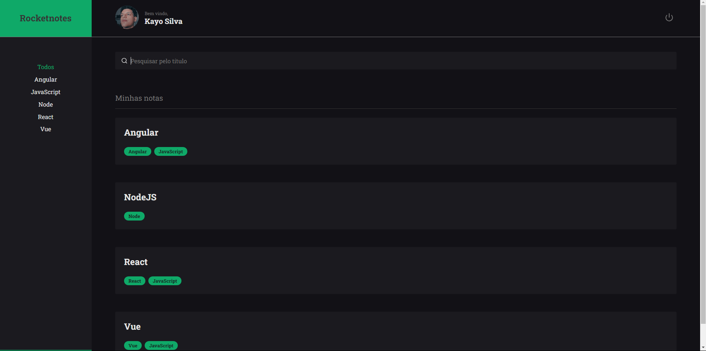
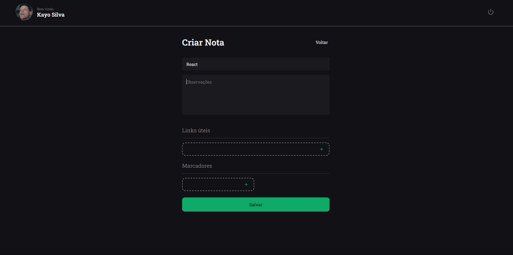
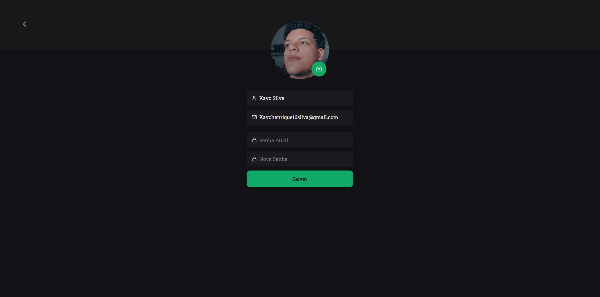

Status: Completo 🚀

## Rocket Notes
Rocket Notes é uma aplicação que permite a você registrar suas anotações, além de inserir links e tags em cada nota. Também é possível filtrar suas notas pelos temas cadastrados através das tags.

## Funcionalidades:
 * Criação de usuário
 * Atualização de usuário
 * Autenticação de usuário (Token JWT)
 * Criação de notas
 * Listagem de notas
 * Filtro de notas
 * Detalhes das notas
 * Exclusão de notas

<hr/>
<br/>

<center> 
<div> </div>
 <div> </div>
<div></div>
</center>
<br/>
<hr/>

## Tecnologias Utilizadas:

 * React
 * styled-components
 * Lucide React
 * prettier plugin tailwindcss
 * typescript
 * eslint

## Back-End 
<a href="https://github.com/okayosilva/rocketnotes-api">Acesse</a>

<hr/>

 ## Demonstração:
 
<div>
    <a href="https://rocketnotes-5ee3.vercel.app/">Acesse</a>
</div>

## Instalação
  * Faça um clone do repositório do projeto no GitHub.
  * Navegue até o diretório do projeto.
  * Execute o seguinte comando para instalar as dependências:

```
$ pnpm install
```

## Running the project
```
$ pnpm run dev
```


